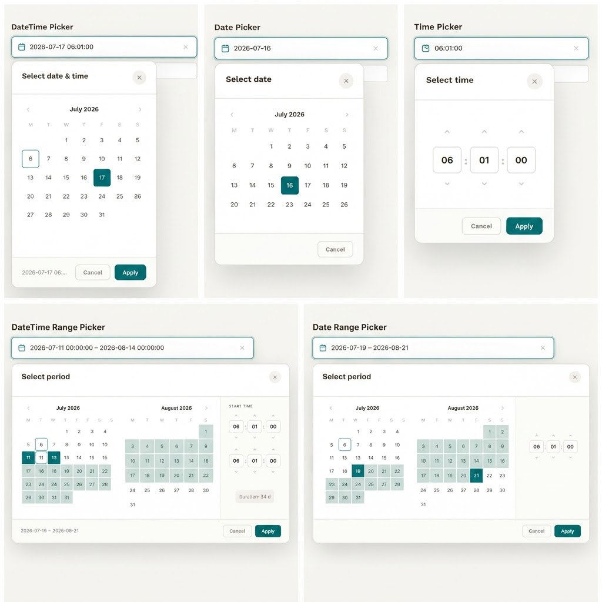

# ngx-datetime-kit

<!-- TODO: Replace with actual badge URLs after first CI run and npm publish -->
[](https://github.com/Robin-Bley/ngx-datetime-kit/actions/workflows/ci.yml)
[](https://www.npmjs.com/package/ngx-datetime-kit)
[](LICENSE)

Production-ready Angular 22+ library for **Date**, **Time**, **DateTime**, **Date Range**, and **DateTime Range** pickers — with full accessibility, i18n, Reactive Forms **and** Signal Forms support.

> 🚀 This library is still new. Feedback is very welcome and improvements will be implemented as quickly as possible. Pull requests are also highly appreciated and will be reviewed promptly.

> 📸 **Screenshot placeholder**
> 

## Live Demo

> 🔗 **[StackBlitz Live Demo](https://stackblitz.com/github/Robin-Bley/ngx-datetime-kit?file=README.md)**

## Features

- ✅ **5 Picker Components**: `ngx-time-picker`, `ngx-date-picker`, `ngx-date-time-picker`, `ngx-date-range-picker`, `ngx-date-time-range-picker`
- ✅ **No free text input** — all values via picker UI only
- ✅ **Full keyboard accessibility** (arrow keys, Tab, Enter, Escape)
- ✅ **ARIA roles, labels, focus trapping** via Angular CDK a11y
- ✅ **24h format, optional seconds**
- ✅ **Responsive**: Desktop popover, Mobile bottom-sheet, Tablet adaptive
- ✅ **Adapter pattern** — pluggable adapter for Luxon, date-fns, or any custom type
- ✅ **i18n** — locale-aware weekday/month names, first-day-of-week, configurable labels
- ✅ **Configurable date formats** (DE, US, ISO and custom)
- ✅ **Reactive Forms** — `ControlValueAccessor`, custom validators
- ✅ **Signal Forms** — `model()` two-way binding, `NgxSignalField`, signal validators
- ✅ **Angular Material** — full `mat-form-field` compatibility via `NgxMatFormFieldDirective`
- ✅ **Angular Package Format** (APF) — tree-shakeable, no side effects
- ✅ **Min/Max, disabled, required, custom validators**
- ✅ **Range presets** (Today, Last 7 days, This month, Custom, …)
- ✅ **Duration display** in range pickers

## Installation

```bash
npm install ngx-datetime-kit
```

## Quick Start

### 1. Configure in `app.config.ts`

```typescript
import { bootstrapApplication } from '@angular/platform-browser';
import { AppComponent } from './app/app.component';
import { provideNgxDatetimeKit, NGX_DATE_TIME_FORMATS_DE } from 'ngx-datetime-kit';

bootstrapApplication(AppComponent, {
  providers: [
    provideNgxDatetimeKit({
      formats: NGX_DATE_TIME_FORMATS_DE,
    }),
  ],
});
```

### 2. Import styles in `styles.scss`

```scss
@use 'ngx-datetime-kit/styles/index';
```

### 3. Use Components

```html
<ngx-date-time-range-picker [(value)]="myRange" />
<ngx-date-picker [(value)]="myDate" [minDate]="today" />
<ngx-time-picker [(value)]="myTime" [showSeconds]="true" />
```

## Forms Integration

### Reactive Forms

```typescript
form = new FormGroup({
  range: new FormControl(null, [ngxDateRangeValidator(this.adapter)]),
});
```

### Signal Forms

```typescript
rangeField = createDateTimeRangeSignalField(this.adapter);
// Template: <ngx-date-time-range-picker [(value)]="rangeField.value" />
```

See [docs/forms.md](docs/forms.md) for full examples and comparison.

## Angular Material Integration

All five picker components are fully compatible with Angular Material's
`<mat-form-field>` — including floating labels, `<mat-error>`, `<mat-hint>`,
required markers, disabled state, and error-state highlighting.

### Setup

```bash
npm install @angular/material
```

Import `NgxMatFormFieldDirective` alongside your pickers and Angular Material's
form-field module. The directive activates **automatically** — its selector
matches all five picker element names, so no extra attribute is needed.

```typescript
import { NgxDatePickerComponent, NgxMatFormFieldDirective } from 'ngx-datetime-kit';
import { MatFormFieldModule } from '@angular/material/form-field';

@Component({
  imports: [
    ReactiveFormsModule,
    MatFormFieldModule,
    NgxDatePickerComponent,
    NgxMatFormFieldDirective, // ← activates automatically on ngx-date-picker
  ],
})
```

### Usage

```html
<!-- Date picker -->
<mat-form-field appearance="outline">
  <mat-label>Booking date</mat-label>
  <ngx-date-picker [formControl]="dateCtrl"></ngx-date-picker>
  <mat-error>Please select a date.</mat-error>
</mat-form-field>

<!-- Date-range picker with validator -->
<mat-form-field appearance="outline">
  <mat-label>Date range</mat-label>
  <ngx-date-range-picker [formControl]="rangeCtrl"></ngx-date-range-picker>
  <mat-error>Start must be before end.</mat-error>
</mat-form-field>
```

All five pickers work identically inside `mat-form-field`:
`ngx-date-picker`, `ngx-time-picker`, `ngx-date-time-picker`,
`ngx-date-range-picker`, `ngx-date-time-range-picker`.

> **Note** `@angular/material` is an *optional* peer dependency.
> You only need it if you use `NgxMatFormFieldDirective`.

## Custom Adapter

```typescript
@Injectable()
class LuxonDateTimeAdapter extends NgxDateTimeAdapter<DateTime> { /* ... */ }

provideNgxDatetimeKit({ adapter: LuxonDateTimeAdapter })
```

See [docs/adapter.md](docs/adapter.md).

## Documentation

- [Getting Started](docs/getting-started.md) | [Architecture](docs/architecture.md)
- [Adapter Guide](docs/adapter.md) | [i18n Guide](docs/i18n.md)
- [Format Configuration](docs/formats.md) | [Forms Guide](docs/forms.md)
- [Full API Reference](docs/api.md)

## Contributing

Because the library is still new, issues, ideas, feedback, and pull requests are especially welcome.

See [CONTRIBUTING.md](CONTRIBUTING.md).

## License

MIT — see [LICENSE](LICENSE).
